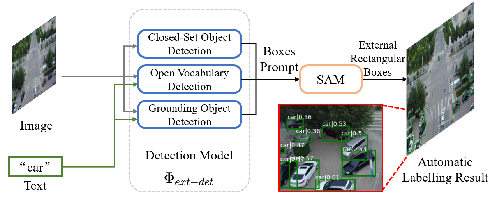

## Overview



## Highlight

- [x] Automatic labelling of objects without training.

- [x] Support representative UAV object detection datasets, include [VisDrone](https://github.com/VisDrone/VisDrone-Dataset).

## TODO

 - [x] Release the labelling code.

## Data Prepare

Take the VisDrone dataset for an example.

#### VisDrone to COCO Format

```shell
python ./tools/VisDrone2COCO.py 
```

You will get the dataset folder structure as:


```
--data
 |-annotations
   |-instances_train2017.json
   |-instances_val2017.json
 |-VisDrone2019-DET-train
   |-images
     |-0000002_00005_d_0000014.jpg
     |-...
 |-VisDrone2019-DET-val
   |-images
     |-0000001_02999_d_0000005.jpg
     |-...
```

## Environment Prepare

```shell
conda create -n automatic-labelling python=3.8 -y
conda activate automatic-labelling
pip install torch==1.9.1+cu111 torchvision==0.10.1+cu111 -f https://download.pytorch.org/whl/torch_stable.html
pip install mmengine

pip install -U openmim
mim install "mmcv>=2.0.0"

git clone https://github.com/open-mmlab/mmdetection.git
cd mmdetection; pip install -e .; cd ..

pip install git+https://github.com/facebookresearch/segment-anything.git
pip install git+https://github.com/openai/CLIP.git
```


## Labelling

First download the following checkpoints and save to './checkpoint'

| Checkpoint | Download Link |
|-------|-------|
| Faster R-CNN | [MMDetection Model](https://download.openmmlab.com/mmdetection/v2.0/faster_rcnn/faster_rcnn_r50_fpn_2x_coco/faster_rcnn_r50_fpn_2x_coco_bbox_mAP-0.384_20200504_210434-a5d8aa15.pth) |
| DINO | [MMDetection Model](https://download.openmmlab.com/mmdetection/v3.0/dino/dino-5scale_swin-l_8xb2-12e_coco/dino-5scale_swin-l_8xb2-12e_coco_20230228_072924-a654145f.pth)
| Detic | [MMDetection Model](https://download.openmmlab.com/mmdetection/v3.0/detic/detic_centernet2_swin-b_fpn_4x_lvis-coco-in21k/detic_centernet2_swin-b_fpn_4x_lvis-coco-in21k_20230120-0d301978.pth) |
| Grounding DINO | [Official Model](https://github.com/IDEA-Research/GroundingDINO/releases/download/v0.1.0-alpha/groundingdino_swint_ogc.pth) |
| GLIP | [Official Model](https://huggingface.co/GLIPModel/GLIP/blob/main/glip_large_model.pth) |


### Closed-Set Object Detection

#### Faster R-CNN + SAM

```shell
python visdrone_style_eval.py ./data/VisDrone ./configs/faster-rcnn_r50_fpn_2x_coco.py ./checkpoint/faster_rcnn_r50_fpn_2x_coco_bbox_mAP-0.384_20200504_210434-a5d8aa15.pth -t visdrone_cls_name.txt -o ./output/faster-rcnn_r50_fpn_2x_coco -b 0.01

```

### Open Vocabulary Detection

#### DINO

```shell
python visdrone_style_eval.py ./data/VisDrone configs/dino-5scale_swin-l_8xb2-12e_coco.py ./checkpoint/dino-5scale_swin-l_8xb2-12e_coco_20230228_072924-a654145f.pth -t visdrone_cls_name.txt -o ./output/dino-5scale_swin-l_8xb2-12e_coco -b 0.01
```

#### Detic + SAM

```shell
python visdrone_style_eval.py ./data/VisDrone configs/Detic_LI21k_CLIP_SwinB_896b32_4x_ft4x_max-size.py ./checkpoint/detic_centernet2_swin-b_fpn_4x_lvis-coco-in21k_20230120-0d301978.pth -t visdrone_cls_name.txt -o ./output/Detic_LI21k_CLIP_SwinB_896b32_4x_ft4x_max-size -b 0.01

```

### Grounding Object Detection

#### GroundingDINO

```shell
python visdrone_style_eval.py ./data/VisDrone configs/GroundingDINO_SwinT_OGC.py ./checkpoint/groundingdino_swint_ogc.pth -t visdrone_cls_name.txt -o ./output/GroundingDINO_SwinT_OGC -b 0.01
```

#### GLIP + SAM

```shell
python visdrone_style_eval.py ./data/VisDrone configs/glip_Swin_L.yaml ./checkpoint/glip_large_model.pth -t visdrone_cls_name.txt -o ./output/glip_large_model -b 0.01
```

## Single Image Labelling

```shell
python detector_sam_demo.py ./data/VisDrone/VisDrone2019-DET-val/images/0000001_02999_d_0000005.jpg configs/Detic_LI21k_CLIP_SwinB_896b32_4x_ft4x_max-size.py ./checkpoint/detic_centernet2_swin-b_fpn_4x_lvis-coco-in21k_20230120-0d301978.pth -t car
```
